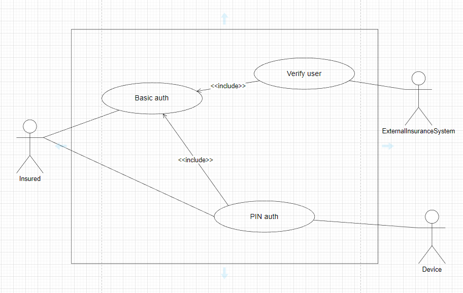

# First-Time auth flow

---

Auteur: F.REGAIEG  
Modifié le : 12/12/2022 09:00

## Intro
Dans le cadre de poursuivre les travaux de conception. Comme convenu, j'ai commencé à faire mon analyse sur le spéc 
fonctionnel (dernière version communiquée), ainsi les points qu'on a discuté dans notre dernier workshop N°5 qui date 
du 2 Déc de l'année courante.

NOTE : Pourtant que j'ai pu me baser sur quelques parties dans le spec, je n'ai pas arrivé à trouver certaines choses 
importantes. Il y a un manque de mise à jour (avec l'état actuel de l'app), precision sur quelques descriptions, ainsi 
le manque de quelques diagrammes. Pour cela je me suis chargé de faire des alternatives.

## Les cas d'utilisation
Je m'intéresse actuellement à 5 cas d'utilisations. Ceux-ci sont les points métiers clés qui m'aident à comprendre ce 
que je devrais faire exactement pour trouver la solution technique et l'appliquer.

1. UC-BasicAuth (Authentification basique)
2. UC-OtpAuth (Authentification avec code OTP)
3. UC-RegisterPinAndDevice (Enregistrement PIN et ID appareil)
4. UC-PinAuth (Authentification avec code PIN)
5. UC-VerifyUser (Vérification au sein d'un système externe d'assurance) 

## Acteurs
A la base des cas susmentionnés, je prévois l'existence de 5 acteurs différents :

1. Insured (Assuré domestique)
2. Device (Appareil Android/iOS)
3. ExternalInsuranceSystem (Système externe d'assurance)
4. SmsSenderApi (API d'envoi de message SMS)
5. MailSenderApi (API d'envoi de message email)

## Diagramme des cas
Du point de vue utilisateur on peut avoir un diagramme très simple :

Pour l'interet de la modélisation qui représente le passage du problème à résoudre depuis l'espace du problème vers
l'espace de la solution, nous aurons besoin d'une forme plus concrete de ce diagramme :

👉 Alors, il existe a priori 5 cas et 5 acteurs potentiellement éligibles.

## Prologue:
Actuellement, je suis arrivé à distinguer les points suivants :
1. La vérification de l'assuré (_Insured_) **au début**, se passee via l'authentification basique

## Cas d'utilisation 1: Basic Auth
### _Etiquette_: 
UC-BasicAuth

### _Description_ :
Ceci décrit le processus d'authentification d'acteur _**Insured**_ pour la premiere fois depuis un acteur _**Device**_.

Au moment d'une tentative de connexion, avec login et mot de passe, le système de l'app mobile, se charge d'envoyer une
requete web au système externe d'assurance (Qui est l'acteur _ExternalInsuranceSystem_) afin d'obtenir une autorisation 
de connexion.

### _Acteurs_ :
1. Insured
2. ExternalInsuranceSystem

### _Package_: << auth >>

### _Conditions préalables_ :
1. L'assuré (_Insured_) doit posséder un appareil mobile dont l'OS est iOS ou Android (_Device_).
2. L'assuré (_Insured_) doit etre enregistré dans un système externe d'assurance (_ExternalInsuranceSystem_).

### _Conditions postérieures_ :
1. L'assuré (_Insured_) obtient une autorisation d'accès à son espace web mobile.

### _Flux de base_ :
1. l'utilisateur (_Insured_) ouvre l'app sur son appareil (_Device_).
2. L’app affiche l’écran d’authentification basique (UI-BasicAuth). (A1)
3. L'assuré s’authentifie en saisissant son login (adresse email) et mot de passe. (A2, A3, A4)
4. Le système d'assurance (_ExternalInsuranceSystem_) fournit une autorisation de connexion.
5. L'utilisateur passe à l'écran suivant.

### _Flux alternatif_ :
* **A1:** Si aucune connexion internet n'est disponible, l'app affiche une alerte d'indisponibilité de connexion internet (UI-NoInternetConnection).
* **A2:** Si le format du login ou mot de passe ne correspond pas aux exigences de l'app, l'utilisateur obtient un message 
d'erreur (e.g: "Le format de l'adresse email est incorrect !").
* **A3:** Si l'utilisateur n'est pas reconnu dans le système de l'app **OU** dans le système externe d'assurance, il reçoit un 
message d'erreur indiquant cette information (e.g: "Aucun utilisateur trouvé !).
* **A4:** Si le système de l'app **OU** le système externe d'assurance ne répond pas, l'app retourne un message d'erreur pour
demander de réessayer l'opération plus tard.

### _Exceptions_ :
* Refaire l'opération.
* Rouvrir l'app.
* Réinstaller l'app.

### _Complexité_ : Normale

### _Priorité_ : Elevée

### _Status_ : Initial

## Cas d'utilisation 2 : Verify User (Vérification utilisateur)
### _Etiquette_:
UC-VerifyUser

### _Description_ :
Ceci décrit le processus d'autorisation d'acteur _**Insured**_. 

L'app ne peut accepter que des utilisateurs enregistrés auparavant sur le portail web _InsuranceWebPortal_, et aussi au 
sein du système externe d'assurance _ExternalInsuranceSystem_.

Une fois qu'il y a une tentative de connexion avec login et mot de passe, l'app commence à chercher l'utilisateur dans 
sa base. Une fois qu'il est trouvé, elle envoie une demande de type server-à-serveur vers le système d'assurance externe 
_ExternalInsuranceSystem_. 
Si l'utilisateur existe dans la base du système externe et n'a aucune contrainte technique ou metier, l'app reçoit une 
autorisation sous forme de clé.

Une fois qu'il y a une tentative de connexion avec un numéro de téléphone, l'app envoi une demande 

### _Acteurs_ :
1. Insured
2. ExternalInsuranceSystem
3. InsuranceWebPortal

### _Package_: << auth >>

### _Conditions préalables_ :
1. La base de données de l'app se charge initialement d'une liste copie-conforme des coordonnées d'utilisateurs :
leur logins (adresse email) et mots de passe, depuis la base de l'acteur _**InsuranceWebPortal**_.
Cette extraction s'effectue uniquement **à la premiere version officielle de l'app**.

### _Conditions postérieures_ :
1. L'assuré (_Insured_) obtient une autorisation d'accès à son espace web mobile.

### _Flux de base_ :
1. l'utilisateur (_Insured_) ouvre l'app sur son appareil (_Device_).
2. L’app affiche l’écran d’authentification basique (UI-BasicAuth). (A1)
3. L'assuré s’authentifie en saisissant son login (adresse email) et mot de passe. (A2, A3, A4)
4. Le système d'assurance (_ExternalInsuranceSystem_) fournit une autorisation de connexion.
5. L'utilisateur passe à l'écran suivant.

### _Flux alternatif_ :
* **A1:** Si aucune connexion internet n'est disponible, l'app affiche une alerte d'indisponibilité de connexion internet (UI-NoInternetConnection).
* **A2:** Si le format du login ou mot de passe ne correspond pas aux exigences de l'app, l'utilisateur obtient un message
  d'erreur (e.g: "Le format de l'adresse email est incorrect !").
* **A3:** Si l'utilisateur n'est pas reconnu dans le système de l'app **OU** dans le système externe d'assurance, il reçoit un
  message d'erreur indiquant cette information (e.g: "Aucun utilisateur trouvé !).
* **A4:** Si le système de l'app **OU** le système externe d'assurance ne répond pas, l'app retourne un message d'erreur pour
  demander de réessayer l'opération plus tard.

### _Exceptions_ :
* Refaire l'opération.
* Rouvrir l'app.
* Réinstaller l'app.

### _Complexité_ : Normale

### _Priorité_ : Elevée

### _Status_ : Initial

## Cas d'utilisation 3 : PIN Auth (TODO)

