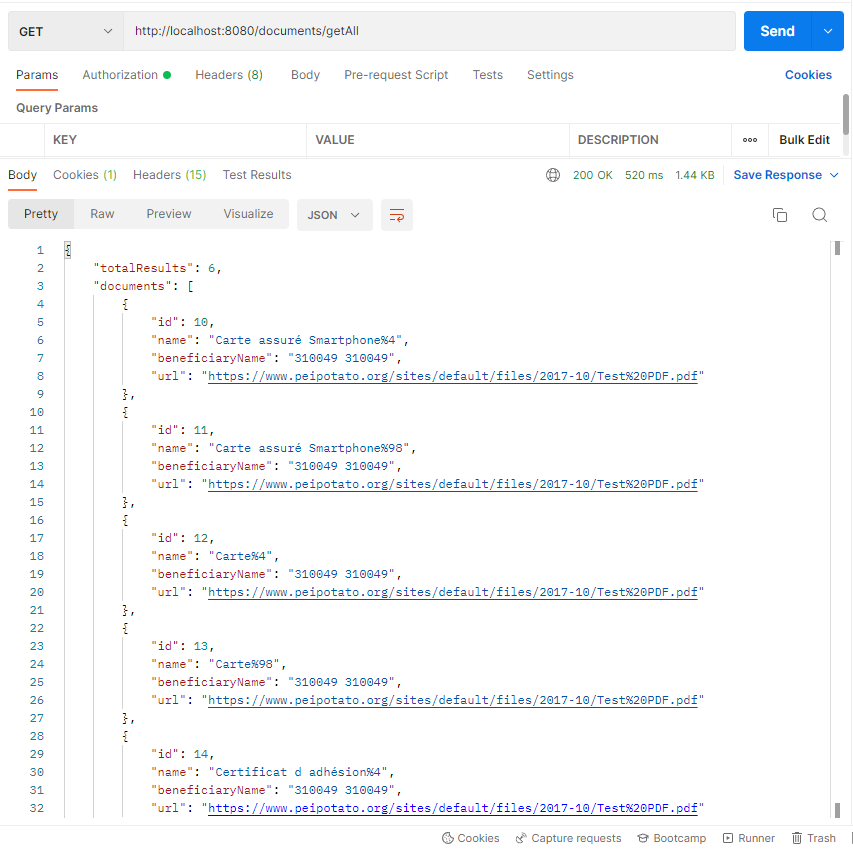

# WS List Docs workflow

Author: F.REGAIEG  
Latest update: 26.08.2022

## Table of contents (TODO)

## Intro
Hiya 👋!

This guide is to help you to get started with WS Documents List
(the keyword 'WS' stands for 'web service') and related business entities workflow.

The main role of this file is to describe the recent work done inside ```/rest/documents```
directory.

## Business Objects
As a start we did some changes inside [**extranet-igatn-domain-jpa**](https://tfs.igaeditions.com/tfs/DefaultCollection/EXTRANET%20MOBILE/_git/extranet-igatn-domain-jpa)
project. The changes are typically located inside the following directories.

1. ``/api/data/ws`` (Contains JPA repositories related to external web-services)
2. ``/impl/domain/ws`` (Contains Business entities related to external web-services)

👉 The objective is to understand how External APIs are stored, used and connected to their own services and other business entities.

> **Currently**, there is no official business modeling for the project, and so far the existing entities are organized spontaneously.
> So, be aware that all details discussed here might be change anytime starting from the moment you read this doc.

### External WS API
Starting with the [**ExternalWsApi**](/domainjpa/impl/domain/ws/entities/ExternalWsApi.java):
This class represent external ws host, it has the following vital fields:
- label (describes the object in one/2 words)
- protocol (such 'http', 'https', 'tcp' or else)
- hostname (such as '192.168.1.1' or 'mysite.v1')
- port (such as '8080', '19000' or else)
- rootPath (such as '/', '/api' or else)

In our case this class represents any external [web API](https://developer.mozilla.org/en-US/docs/Learn/JavaScript/Client-side_web_APIs/Introduction#what_are_apis)
that our app connect to, such as:
- Insurance system
- Payment system
- Notification System

> Currently, only **Insurance System** REST API is considered as **ExternalWsApi** entity.
>

### External WS Configuration
The [**WsConfig**](/domainjpa/impl/domain/ws/entities/WsConfig.java) class holds web service specs. The following
fields are important to know:
- host (refers to **ExternalWsApi** object.)
- label (describes the object in one/2 words)
- path ( such as '/users/20/reimbursements')
- method (such as 'GET', 'POST', 'UPDATE' or else)
- mediaType (such as 'application/json')

In our case, this class represents any external [web-service](https://www.oracle.com/fr/cloud/definition-web-service/)
related to any [web API](https://developer.mozilla.org/en-US/docs/Learn/JavaScript/Client-side_web_APIs/Introduction#what_are_apis).

### Central point for web-service
The [**WsExternal**](/domainjpa/impl/domain/ws/WsExternal.java) interface holds some models about related external web services
genenrally as constants and encapsulated entities, this is useful to avoid making errors while calling a web service
more than one time or when reusing a parameter/response attribute.

The following is the 1st appearance of this interface:

```java
public interface WsExternal {

    String PROTOCOL_HTTP = WsHostProtocol.HTTP.getName();
    String PROTOCOL_HTTPS = WsHostProtocol.HTTPS.getName();
    
    interface WsDoc {

        // check ws docs in external system API (http://192.168.216.17:5700/swagger/index.html)
        String BASE_PATH = "Documents";
        String LIST_PATH = "GetAll";
        
        // parameters
        String PARAM_LANGUAGE = WsDocParameter.LANGUAGE.getName();
        String PARAM_RESULT_FROM = WsDocParameter.QUERY_START.getName();
        String PARAM_RESULT_TO = WsDocParameter.QUERY_END.getName();

        // parameters as enum
        enum WsDocParameter {

            LANGUAGE("language"),
            QUERY_START("skip"),
            QUERY_END("take");

            private String name;

            WsDocParameter(String name) {
                this.name = name;
            }

            public String getName() {
                return name;
            }
        }

        @Data
        class WsListDocsFormat {
            int totalResults;
            List<DocumentItem> items;
        }

        @Data
        class DocumentItem {
            String id;
            String name, beneficiaryName, url;
        }
    }
}
```

👉 By reading the code mentioned above ☝️ we can see that:
- There is exactly 2 protocols (http and https) to deal with External REST APIs. (the first 2 variables)
- There is a group of services that takes care about the term 'document'! (the inner interface 'WsDoc')

👉 By using [lombok](https://projectlombok.org/)'s annotation such as `@Data`, we can just write attributes names and let
the rest to be managed by lombok.

### Ws Jpa Repositories
Still inside [**extranet-igatn-domain-jpa**](https://tfs.igaeditions.com/tfs/DefaultCollection/EXTRANET%20MOBILE/_git/extranet-igatn-domain-jpa)
project, we've added some changes as follows:

Adding 2 abstract methods under **ExternalWsApiRepository** interface:

- findByLabel[Contains](https://docs.spring.io/spring-data/jpa/docs/current/reference/html/#:~:text=%2C%20Containing%2C-,Contains,-the%20respective%20arguments) (label)
- findByHostnameAndPort(hostname, port)
```java
public interface ExternalWsApiRepository extends CrudRepository<ExternalWsApi, Integer> {

    Optional<ExternalWsApi> findByLabelContains(String label);
    ExternalWsApi findByHostnameAndPort(String hostname, int port);

}
```

Adding 1 abstract method under **WsConfigRepository** interface:
- findByHostId(id)

```java
public interface WsConfigRepository extends CrudRepository<WsConfig, Integer> {
    WsConfig findByHostId(int id);
}
```

### Spring Jpa Runner class
Still inside [**extranet-igatn-domain-jpa**](https://tfs.igaeditions.com/tfs/DefaultCollection/EXTRANET%20MOBILE/_git/extranet-igatn-domain-jpa)
project, under ``/impl/domain/ws`` directory, you must face a class called **WsSpringJpaRunner** which contains a sort of
database initializer. It uses [CommandLineRunner](https://docs.spring.io/spring-boot/docs/current/api/org/springframework/boot/CommandLineRunner.html)
provided from Spring.

```java
@Profile(value = {"develop","test"})
@Configuration
public class WsSpringJpaRunner {

    @Autowired
    ExternalWsApiRepository externalWsApiRepository;

    @Autowired
    WsConfigRepository wsConfigRepository;

    @Bean
    public CommandLineRunner wsDataLoader() {

        return args -> {

            final String DATE_NOW = SimpleDateFormatter.formatDate(Instant.now());

            // ----------------- ws host
            final String EXTERNAL_API_HOSTNAME = "192.168.216.17";
            final int EXTERNAL_API_PORT = 5700;
            final String EXTERNAL_API_MAIN_PATH = "/api";
            final String EXTERNAL_API_LABEL = "Insurance External System";

            final ExternalWsApi externalApi = ExternalWsApi.externalWsApiBuilder()
                    .label(EXTERNAL_API_LABEL)
                    .protocol(WsExternal.PROTOCOL_HTTP)
                    .hostname(EXTERNAL_API_HOSTNAME)
                    .port(EXTERNAL_API_PORT)
                    .rootPath(EXTERNAL_API_MAIN_PATH)
                    .createdAt(DATE_NOW)
                    .create();

            externalWsApiRepository.save(externalApi);

            // ----------------- ws Config
            final String wsPath = "/"
                    .concat(WsDoc.BASE_PATH)
                    .concat("/")
                    .concat(WsDoc.LIST_PATH);

            final String EXTERNAL_WS_LABEL = "Insured documents";

            final WsConfig wsConfig = WsConfig.wsConfigBuilder()
                    .label(EXTERNAL_WS_LABEL)
                    .host(externalApi)
                    .method(HttpMethod.GET)
                    .mediaType(MediaType.APPLICATION_JSON.toString())
                    .path(wsPath)
                    .createdAt(DATE_NOW)
                    .create();

            wsConfigRepository.save(wsConfig);
        };
    }
}
```

📌 This class must be visible to other beans when one of 2 profiles is activated :
1. develop: Means during application deployment and local modification
2. test: Means during developing tests locally;

📌 This class calls 2 beans:
1. ExternalWsApiRepository
2. WsConfigRepository

📌 This class declares 1 command line runner bean: The role of this bean is to instantiate entities objects and persist them
respectively in the database.

👉 Both 'develop' &'test' profiles can use remote/local/in-memory database. But we strongly recommend to use in-momory database
or a local one instead of touching remote.

> If you don't know about profiles in Spring, we strongly recommend you to visit the [Baeldung guide on profiles](https://www.baeldung.com/spring-profiles),
> which seems to be perfect especially for beginners, although, if you don't feel comfortable with the examples, you can check [the complete code on Github](https://github.com/eugenp/tutorials/tree/master/spring-core-2)

### Testing WS entities
We've added a simple test to our discussed entities, in **WsConfigTest** file :

let's first check the class header content:
```java
@SpringBootTest
@AutoConfigureTestDatabase
@ExtendWith(SpringExtension.class)
@EnableAutoConfiguration(exclude = {
        SecurityAutoConfiguration.class,
        ManagementWebSecurityAutoConfiguration.class 
})
class WsConfigTest {...}
```
- We use ``@AutoConfigureTestDatabase`` to autoconfigure a separate database (other than the one declared in our config file(s)).
- The ``@ExtendWith`` is required to resolve some params and inject spring test extension inside junit.
- You must notice that we exclude autoconfig for security in order to jump auth for example.

The content of the class is **quite close** to what we saw inside **WsSpringJpaRunner** class previously.

👉 The only obvious changes are **assertions**.

> FWIW Assertions tools are from [Junit](https://junit.org/junit5/). If you need to know more about assertions, please visit [this guide](https://www.baeldung.com/junit-assertions).
> It's worth noting that assertion exist in Java core language, check [this link](https://www.baeldung.com/java-assert).

## Using WS list docs
Now we move into changes made inside [**extranet-igatn-rest-api**](https://tfs.igaeditions.com/tfs/DefaultCollection/EXTRANET%20MOBILE/_git/extranet-igatn)
the main project 🙌.

Our entry point is **DocumentController** class, the changes we've made inside can be recapped: We switch from [json-server](https://github.com/typicode/json-server)
to [the real external insurance system REST API](http://192.168.216.17:5700/swagger/index.html).

The ``/getAll`` endpoint handler method now uses **DocumentService** to communicate to the external API, execute logs, formatting and more...

### Document service
**DocumentService** is an interface that has a method ``getAll(params)``.

This interface is implemented by **DocumentServiceImpl** class:

In the first part of this class, we fetch external ws API object from database.

Currently, as we don't possess clear vision on relationships between these:
- client
- External ws API
- User

We fetch the API via its label ``"Insurance External System"``, this is temporary 😜.

Code:
```java
@Slf4j
@Service
public class DocumentServiceImpl implements DocumentService {
    
    // ... autowiring required beans
    
    @Override
    public WsListDocResponse getAll(WsListDocParams params) {

        // .. some code
        
        externalWsApi = externalWsApiRepository.findByLabelContains(INSURANCE_EXTERNAL_API)
                .orElseThrow(() -> new WsExternalApiNotFoundException(
                        String.format("No WS External API with label: \"%s\" is available", INSURANCE_EXTERNAL_API)));

        UriComponents wsListDocsUriBuilder = UriComponentsBuilder.newInstance()
                .scheme(externalWsApi.getProtocol())
                .host(externalWsApi.getHostname())
                .port(externalWsApi.getPort())
                .path(externalWsApi.getRootPath())
                .pathSegment(WsDoc.BASE_PATH, WsDoc.LIST_PATH)
                .queryParam(WsDoc.PARAM_LANGUAGE, params.getLanguage())
                .queryParam(WsDoc.PARAM_RESULT_FROM, params.getIndexFrom())
                .queryParam(WsDoc.PARAM_RESULT_TO, params.getIndexTo())
                .build();

        URI uri = wsListDocsUriBuilder.toUri();

        // .. other code
    }
}
```
👉 The code mentioned above, fetches ws external API via its label, the system has to watch out for ``WsExternalApiNotFoundException```!

👉 If the object exist, we build a URI relying on its attributes (protocol, hostname etc...).

The rest of the code is close to the previous execution (with json-server)

### Important to know
The external ws API returns documents objects without IDs! knowing that there is an attribute called `"id"` 🤯. Actually,
this could make the client side unable to loop through the list. This is why we managed generate unique ids for this list as follows:

In addition, there is no URLs for docs! (as we said, there might be an update coming soon).

```java

@Service
public class DocumentServiceImpl implements DocumentService {

    @Autowired
    private RestTemplate restTemplate;

    @Autowired
    private ExternalWsApiRepository externalWsApiRepository;

    @Override
    public WsListDocResponse getAll(WsListDocParams params) {
        
        // some code

        try {
            
            // some other code
            
            List<WsListDocItem> finalDocuments = StreamUtils
                .zipWithIndex(
                    externalWsListDocResponse
                        .getBody()
                        .getItems()
                        .stream()
                )
                .map(di -> {
                    WsListDocItem wsListDocItem = new WsListDocItem();
                    wsListDocItem.setId(di.getIndex() + 10);
                    wsListDocItem.setName(di.getValue().getName());
                    wsListDocItem.setBeneficiaryName(di.getValue().getBeneficiaryName());
                    // FRE - WARNING: this URL is to get empty pdf from the web
                    // it's a temporary solution, waiting for the update in external insurance system
                    wsListDocItem.setUrl("https://www.peipotato.org/sites/default/files/2017-10/Test%20PDF.pdf");

                    Indexed<WsListDocItem> documentItemIndexed = Indexed.index(di.getIndex(), wsListDocItem);

                    return documentItemIndexed;
                })
                .map(i -> i.getValue())
                .collect(Collectors.toList());

            response.setDocuments(finalDocuments);
            return response;
            
        } catch (WsExternalApiNotFoundException e) {
            e.printStackTrace();
        }

        return null;
    }
}
```

### Testing service documents list
We're sure that the service works fine as expected:  


Although, we still need to have a validates the job done here: we've made a test inside a class called **DocumentControllerTest** :
1. declaring external ws api entity.  
```java
final String DATE_NOW = SimpleDateFormatter.formatDate(Instant.now());
final String EXTERNAL_API_HOSTNAME = "192.168.216.17";
final int EXTERNAL_API_PORT = 5700;
final String EXTERNAL_API_MAIN_PATH = "/api";
final String EXTERNAL_API_LABEL = "Insurance External System";

final ExternalWsApi EXTERNAL_API_1 = ExternalWsApi.externalWsApiBuilder()
        .label(EXTERNAL_API_LABEL)
        .protocol(WsExternal.PROTOCOL_HTTP)
        .hostname(EXTERNAL_API_HOSTNAME)
        .port(EXTERNAL_API_PORT)
        .rootPath(EXTERNAL_API_MAIN_PATH)
        .createdAt(DATE_NOW)
        .create();
```
2. mocking the JPA repository.
3. Building objects as those coming from external web api.
4. Building objects as those going out from our system to client side.
5. Building URI with ws path + parameters
6. mocking external rest api server.
7. calling service et comparing data declared inside

This is almost everything to know about WS Docs list in backend side. 😃

However, this doc might be updated following upcoming 
plans and actions.

thank you for your time 👋