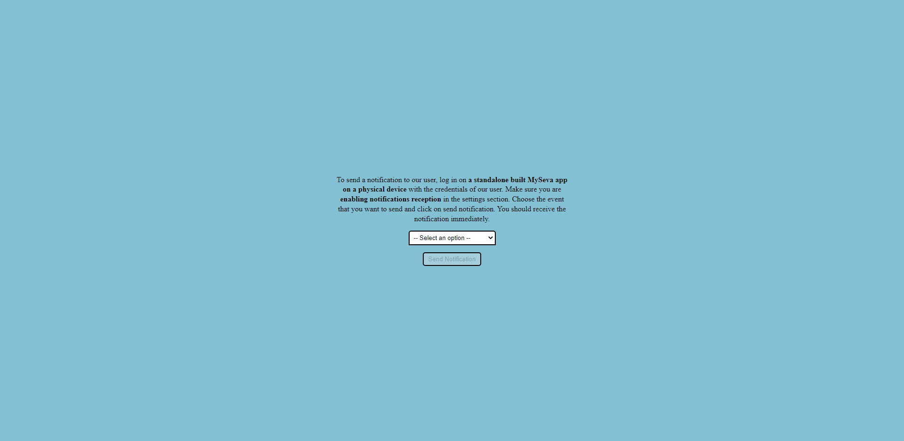

# Explication du mécanisme de l'envoi/réception des notifications

Le mécanisme est encapsulé dans un controlleur REST appelé `NotificationController` et séparé sur des différents points de sortie. Le rôle de chaque point est bien décrit dessous:

- `/updateToken`: Ce point de sortie est utilisé pour la sauvegarde du jeton d'enregistrement au service de notifications dans la base de données. L'opération commence par l'extraction de la classe `User` de l'utilisateur connecté, ce dernier doit possèder déjà une configuration particulère au service de notifications, définie sous la classe `NotificationConfig`, qui comporte ces deux attributs:
  - `token`: Le jeton d'enregistrement au service de notifications, c'est l'identifiant que le service doit utiliser afin d'envoyer la notification à l'appareil de l'utilisateur connecté.
  - `active`: C'est l'attribut qui détermine si le service de notifications est active chez l'utilisateur.

L'opération continue avec le stockage du nouveau jeton, qui se trouve dans le corps de la requête, dans l'attribut `token` de la configuration et la sauvegarde de cette dernière dans la base de données. Le service Web retourne une réponse de succès générique contenant un attribut `success`.

- `/send`: Ce point de sortie est utilisé pour l'envoi des notifications à un certain utilisateur. Il supporte ces deux paramètres:
  - `userId`: L'ID de l'utilisateur qui va recevoir la notification.
  - `evtType`: Le sujet de la notification que l'utilisateur va recevoir.

Le service Web supporte trois types d'évènements:

    - PR: Ce code fait une référence au mot Premiums, et signifie que la notification va alerter l'utilisateur qu'une nouvelle cotisation est ajoutée et doit être payée.
    - RM: Ce code fait une référence au mot Reimbursements, et signifie que la notification va informer l'utilisateur qu'il a reçu un nouveau remboursement.
    - PL: Ce code fait une référence au mot Policies, et signifie que la notification va alerter l'utilisateur que son contrat vient de finir et qu'il doit le renouveler.

Ce service Web a été conçu pour l'équipe SAGILEA afin de lui offrir une solution simple pour envoyer les notifications, et il est exclu de la sécurité de Spring Boot parce qu'il ne va pas être exploité par des utilisateurs authentifiés. Il a été aussi implémenté à l'aide de [l'API FCM de Firebase](https://firebase.google.com/docs/cloud-messaging), pour pouvoir gérer l'envoi des notifications à travers une solution *server-side*. L'opération passe par les étapes suivantes:

N.B: Il faut absolument noter que cette opération est effectuée à l'aide d'une dépendance Maven appelée [GoogleAuthLibrary](https://github.com/googleapis/google-auth-library-java). Cette dépendance sert à s'authentifier avec le système Firebase afin de pouvoir envoyer des notifications. Pour pouvoir s'authentifier, nous devons télécharger un fichier appelé service-account.json depuis la console de notre projet Firebase, et le rendre accessible pour la lecture depuis notre controlleur REST. 

Pour le télécharger, nous pouvons nous diriger vers les paramètres du projet (Accessibles depuis l'icône *Outil* en haut à gauche), puis cliquer sur l'onglet *comptes de service (service accounts)*, puis cliquer sur le bouton générer une nouvelle clé privée. 

    - L'opération commence par l'extraction de l'utilisateur que son ID a été passé comme paramètre dans la requête. 
    - Si l'utilisateur n'est pas trouvé, le service Web retourne une erreur de code 500.
    - Si cet utilisateur est trouvé, une vérification sur la validité du paramètre evtType s'effectue afin de pouvoir déterminer le sujet de la notification.
    - Si le paramètre n'est pas valide, le service Web retourne une erreur de code 500.
    - Si le paramètre est valide, une nouvelle notification est créée avec les paramètres suivants: 
      - Titre (Déterminé par rapport au paramètre evtType).
      - Message (Déterminé par rapport au paramètre evtType).
      - Type (Déterminé par rapport au paramètre evtType): Cette propriété fait une référence à la classe enum NotificationTypes.
      - Destinataire: L'utilisateur dont l'ID a été passé comme paramètre dans la requête.
      - Vu: Cette propriété est initialisée à false puisque c'est une nouvelle notification.
      - Date de création: Cette propriété est initilaisée au moment de création.
      - Date de modification: Cette propriété est initilaisée au moment de création.
    - La notification est stockée dans la base de données à l'aide du Repository de la classe Notification.
    - L'opération continue avec la vérification de l'activation du service de notification chez l'utilisateur.
    - Si le service n'est pas activé, l'opération est interrompue et le service Web retourne une réponse de succès.
    - Si le service est activé, une authentification au service de Firebase se fait à travers la dépendance GoogleAuthLibrary, en utilisant l'URL pour le fichier qui contient les paramètres d'authentification, ainsi qu'un paramètre pour spécifier la portée des services que nous voulons exploiter, qui est fourni déjà par Firebase. Ces deux paramètres sont bien définis dans le fichier application.properties.
    - Si l'authentification n'est pas passée, le service Web retourne une erreur de code 500.
    - Si l'authentification s'est bien passée, un jeton d'authentification est retourné afin de l'exploiter dans l'appel au service d'envoi des notifications.
    - Un appel HTTPS au point de sortie de Firebase va être préparé (Dont l'URL est défini dans le fichier application.properties), avec le passage du jeton retourné dans l'étape précédente dans l'en-tête de la requête, et la préparation du corps de la notification, pour avoir plus d'idée sur le format du corps de la notification, vous pouvez vous référer à la document de l'API FCM de Firebase.  
    - Pour des raisons de confidentialité, nos utilisateurs vont toujours recevoir des notifications avec un titre et un message abstraits, les informations sur la nouvelle notification seront visualisées quand l'utilisateur ouvre l'application.
    - Si l'opération d'envoi des notifications échoue, le service Web retourne une erreur de code 500.
    - Si l'opération est bien réussie, le service Web retourne une réponse de succès. 

- `/toggleNotifications`: Ce point de sortie est utilisé pour activer/désactiver la réception des notifications pour l'utilisateur concerné. L'opération est similaire à celle faite par le service Web `/updateToken`, la seule différence est que ce service Web va changer l'attribut `active` de la configuration et pas l'attribut `token`. Ce changement se fait en basculant la valeur de l'attribut vers l'état opposé.

## Modifications au niveau des détails de l'utilisateur

Pour pouvoir lire l'état du service de réception des notification chez l'utilisateur, nous avons modifié la réponse du service Web `/users/getDetails` pour supporter le retour d'une valeur booléenne indiquant l'état du service. Cette valeur va être utilisé dans l'application mobile pour afficher l'état dans l'écran des paramètres.

## Test de la fonctionnalité de l'envoi des notifications

Nous avons réalisé que tester cette fonctionnalité à travers une API ne sera pas très pratique, du coup nous avons préparé une interface graphique accessible à travers le lien `/test/notifications`. Nous avons mis ce qui est nécessaire comme opérations pour pouvoir tester l'envoi des notifications, ainsi qu'un menu déroulant pour choisir l'évènement à envoyer, et un bouton pour soumettre le formulaire. Le test est considéré réussi si vous recevez la notification immédiatement sur l'appareil de l'utilisateur.

